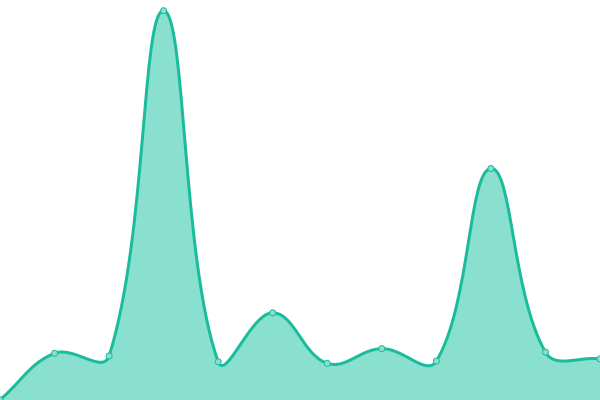
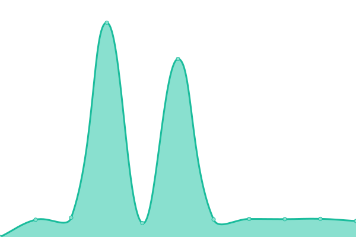
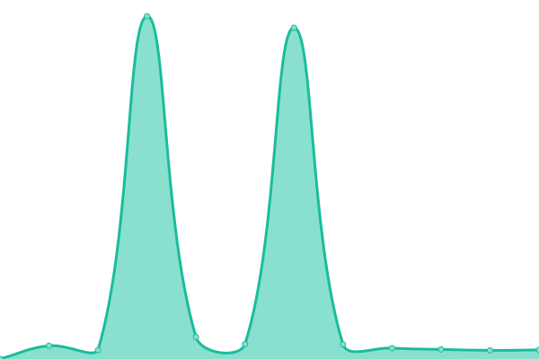
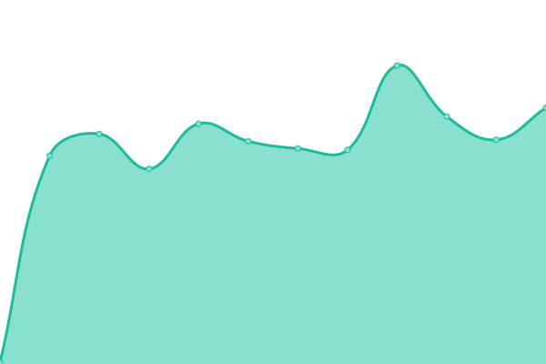
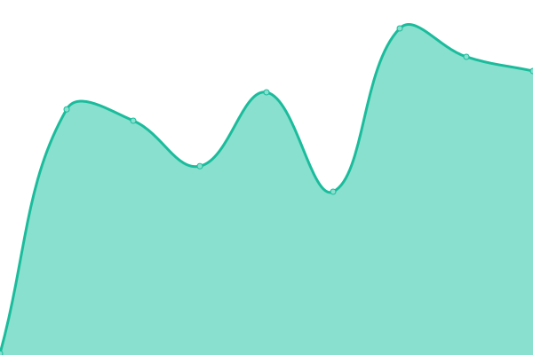
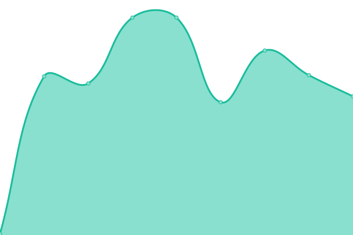
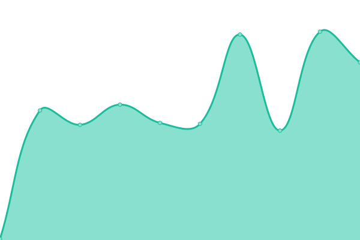
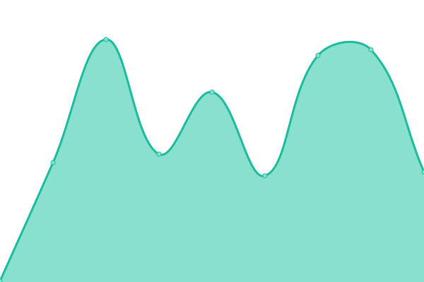
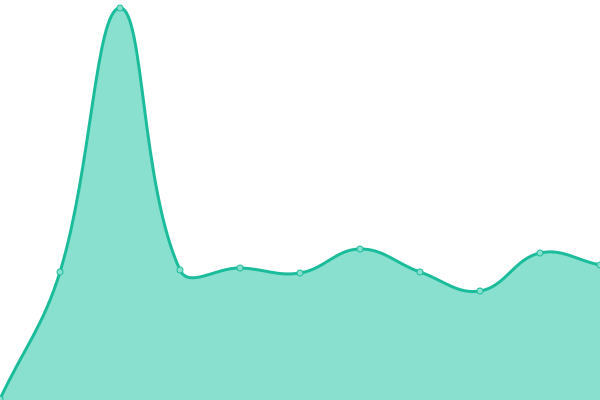
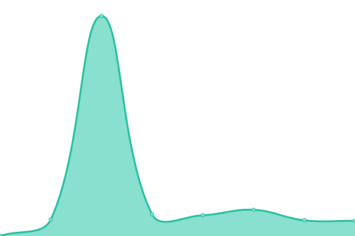

# [📈 Live Status](https://abrgen.github.io/Cor): <!--live status--> **🟧 Partial outage**

This repository contains the open-source uptime monitor and status page for [abrgen](https://abrgen.github.io/Cor), powered by [Upptime](https://github.com/upptime/upptime).

With [Upptime](https://upptime.js.org), you can get your own unlimited and free uptime monitor and status page, powered entirely by a GitHub repository. We use [Issues](https://github.com/abrgen/Cor/issues) as incident reports, [Actions](https://github.com/abrgen/Cor/actions) as uptime monitors, and [Pages](https://abrgen.github.io/Cor) for the status page.

<!--start: status pages-->
<!-- This summary is generated by Upptime (https://github.com/upptime/upptime) -->
<!-- Do not edit this manually, your changes will be overwritten -->
<!-- prettier-ignore -->
| URL | Status | History | Response Time | Uptime |
| --- | ------ | ------- | ------------- | ------ |
|  [coregistros.com](https://www.coregistros.com) | 🟩 Up | [coregistros-com.yml](https://github.com/abrgen/Cor/commits/HEAD/history/coregistros-com.yml) | 

 635ms
     
 | 

<a href="https://abrgen.github.io/Cor/history/coregistros-com">94.71%</a>
    

|  [mitest.de](https://mitest.de) | 🟩 Up | [mitest-de.yml](https://github.com/abrgen/Cor/commits/HEAD/history/mitest-de.yml) | 

 2362ms
     
 | 

<a href="https://abrgen.github.io/Cor/history/mitest-de">94.70%</a>
    

|  [bevrand.com](https://www.bevrand.com) | 🟩 Up | [bevrand-com.yml](https://github.com/abrgen/Cor/commits/HEAD/history/bevrand-com.yml) | 

 1012ms
     
 | 

<a href="https://abrgen.github.io/Cor/history/bevrand-com">94.70%</a>
    

|  [milopciones.es](https://milopciones.es) | 🟩 Up | [milopciones-es.yml](https://github.com/abrgen/Cor/commits/HEAD/history/milopciones-es.yml) | 

 2118ms
     
 | 

<a href="https://abrgen.github.io/Cor/history/milopciones-es">94.69%</a>
    

|  [g0crm.info (API WP)](https://www.g0crm.info/wp-login.php) | 🟥 Down | [g0crm-info-api-wp.yml](https://github.com/abrgen/Cor/commits/HEAD/history/g0crm-info-api-wp.yml) | 

 1763ms
     
 | 

<a href="https://abrgen.github.io/Cor/history/g0crm-info-api-wp">0.00%</a>
    

|  [blog.sorteopremios.com](https://blog.sorteopremios.com) | 🟩 Up | [blog-sorteopremios-com.yml](https://github.com/abrgen/Cor/commits/HEAD/history/blog-sorteopremios-com.yml) | 

 2600ms
     
 | 

<a href="https://abrgen.github.io/Cor/history/blog-sorteopremios-com">94.03%</a>
    

|  [daily.g0crm.com](https://daily.g0crm.com) | 🟥 Down | [daily-g0crm-com.yml](https://github.com/abrgen/Cor/commits/HEAD/history/daily-g0crm-com.yml) | 

 1820ms
     
 | 

<a href="https://abrgen.github.io/Cor/history/daily-g0crm-com">0.00%</a>
    

|  [crm.g0crm.com](https://crm.g0crm.com/robots.txt) | 🟩 Up | [crm-g0crm-com.yml](https://github.com/abrgen/Cor/commits/HEAD/history/crm-g0crm-com.yml) | 

 246ms
     
 | 

<a href="https://abrgen.github.io/Cor/history/crm-g0crm-com">94.69%</a>
    

|  [sorteopremios.com](https://sorteopremios.com) | 🟩 Up | [sorteopremios-com.yml](https://github.com/abrgen/Cor/commits/HEAD/history/sorteopremios-com.yml) | 

 287ms
     
 | 

<a href="https://abrgen.github.io/Cor/history/sorteopremios-com">94.68%</a>
    

|  [admin.coregistros.com](https://admin.coregistros.com/login.php) | 🟩 Up | [admin-coregistros-com.yml](https://github.com/abrgen/Cor/commits/HEAD/history/admin-coregistros-com.yml) | 

 145ms
     
 | 

<a href="https://abrgen.github.io/Cor/history/admin-coregistros-com">69.02%</a>
    

|  [go.coregistros.com](https://go.coregistros.com) | 🟩 Up | [go-coregistros-com.yml](https://github.com/abrgen/Cor/commits/HEAD/history/go-coregistros-com.yml) | 

 135ms
     
 | 

<a href="https://abrgen.github.io/Cor/history/go-coregistros-com">94.68%</a>
    

|  [go.mitest.de](https://go.mitest.de) | 🟩 Up | [go-mitest-de.yml](https://github.com/abrgen/Cor/commits/HEAD/history/go-mitest-de.yml) | 

 124ms
     
 | 

<a href="https://abrgen.github.io/Cor/history/go-mitest-de">94.68%</a>
    

|  [api2.g0crm.com](https://api2.g0crm.com) | 🟩 Up | [api2-g0crm-com.yml](https://github.com/abrgen/Cor/commits/HEAD/history/api2-g0crm-com.yml) | 

 122ms
     
 | 

<a href="https://abrgen.github.io/Cor/history/api2-g0crm-com">94.68%</a>
    

|  [api3.g0crm.com](https://api3.g0crm.com/openapi.json) | 🟩 Up | [api3-g0crm-com.yml](https://github.com/abrgen/Cor/commits/HEAD/history/api3-g0crm-com.yml) | 

 127ms
     
 | 

<a href="https://abrgen.github.io/Cor/history/api3-g0crm-com">94.68%</a>
    

|  [app.milopciones.es](https://app.milopciones.es) | 🟨 Degraded | [app-milopciones-es.yml](https://github.com/abrgen/Cor/commits/HEAD/history/app-milopciones-es.yml) | 

 1395ms
     
 | 

<a href="https://abrgen.github.io/Cor/history/app-milopciones-es">0.00%</a>
    

|  [go.bevrand.com](https://go.bevrand.com) | 🟩 Up | [go-bevrand-com.yml](https://github.com/abrgen/Cor/commits/HEAD/history/go-bevrand-com.yml) | 

 162ms
     
 | 

<a href="https://abrgen.github.io/Cor/history/go-bevrand-com">94.68%</a>
    

|  [go.topcausas.org](https://go.topcausas.org) | 🟩 Up | [go-topcausas-org.yml](https://github.com/abrgen/Cor/commits/HEAD/history/go-topcausas-org.yml) | 

 132ms
     
 | 

<a href="https://abrgen.github.io/Cor/history/go-topcausas-org">94.68%</a>
    

|  [leadcure.coregistros.com](https://leadcure.coregistros.com) | 🟩 Up | [leadcure-coregistros-com.yml](https://github.com/abrgen/Cor/commits/HEAD/history/leadcure-coregistros-com.yml) | 

 153ms
     
 | 

<a href="https://abrgen.github.io/Cor/history/leadcure-coregistros-com">94.68%</a>
    

<!--end: status pages-->

[**Visit our status website →**](https://abrgen.github.io/Cor)

## 📄 License

- Powered by: [Upptime](https://github.com/upptime/upptime)
- Code: [MIT](./LICENSE) © [Anand Chowdhary](https://anandchowdhary.com), supported by [Pabio](https://pabio.com)
- Data in the `./history` directory: [Open Database License](https://opendatacommons.org/licenses/odbl/1-0/)
